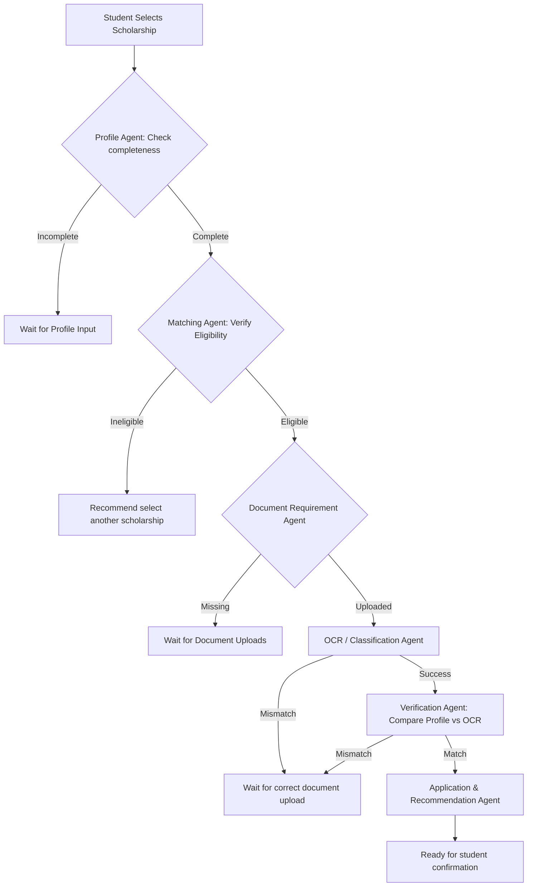

# ScholarAI Agentic AI Platform Architecture

This document describes the design and orchestration of the Agentic AI platform for Intelligent Scholarship Eligibility and Personalized Recommendations.

## Core Architecture & Workflow Flow

ScholarAI implements a stateful agentic system orchestrated by a central **Supervisor Agent**. The workflow follows a dynamic state machine that checks credentials, matches profile details, audits uploaded documents via OCR, flags mismatches, and determines application readiness.



## Persistent Database State Models

1. **`AgentWorkflowState`** (`agent_workflow_states` table):
   - Keeps track of the student's active scholarship application lifecycle.
   - Core fields: `current_stage`, `current_task`, `profile_status`, `matching_status`, `verification_status`, `application_status`, `required_documents`, `uploaded_documents`, `decision_reason`.

2. **`AgentDecisionLog`** (`agent_decision_logs` table):
   - Audits every decision, evaluation, inputs/outputs, and next planned action taken by any active agent.
   - Core fields: `agent_name`, `action`, `input_context_summary`, `decision`, `result`, `next_action`, `status`.

## API Endpoints Added
- `GET /api/v1/agent/state`: Returns the persistent student workflow state.
- `POST /api/v1/agent/journey/start`: Evaluates state and runs next logical agent.
- `POST /api/v1/agent/journey/reset`: Resets active workflow and clears logs.
- `GET /api/v1/agent/logs`: Returns historical Supervisor activity and decision logs.

## Steps to Run the Project

### 1. Start the Backend Server (FastAPI)
Make sure Python is installed and run:
```bash
cd backend
venv\Scripts\activate
uvicorn app.main:app --reload
```

### 2. Start the Frontend Server (Vite React)
Install dependencies and run the development server:
```bash
npm install
npm run dev
```

## Steps for Mini-Project Review Demonstration
1. **Login**: Register and log in as a student.
2. **Complete Profile**: Go to the Profile page and fill in academic & demographic details.
3. **Start Journey**: Navigate to the **AI Scholarship Journey** page, select a scholarship from the dropdown (e.g. *NSP Merit Scholarship*), and click **Start AI Journey**.
4. **Observe Logs**: The Supervisor will check the profile, verify eligibility, and flag missing documents in the timeline.
5. **Upload Documents**: Navigate to the **Documents** page or use the **Certificate Generator** to generate/upload Aadhaar/Income files.
6. **OCR & Audit Check**: Return to the **AI Scholarship Journey** and click **Sync/Run Next Agent**. The Supervisor will automatically trigger the OCR Agent to classify/extract values, followed by the Verification Agent auditing values against the profile.
7. **Readiness Summary**: Once successfully audited, the Supervisor recommends the scholarship and displays the final guidance panel, ready for student submission confirmation.

---

## Mini-Project Review Demonstration Script

Use this walkthrough table script during your live project presentation to explain to the reviewers exactly what is happening in the background:

| Step you click | What's actually happening (say this to reviewers) |
| :--- | :--- |
| **Login** | "JWT-based authentication establishes the student session; all agent actions are scoped to this authenticated user." |
| **Complete Profile** | "Feeds the Profile Agent's perception layer — this is the data every downstream agent reasons over." |
| **Select scholarship → Start AI Journey** | "Supervisor Agent is invoked. It perceives the current state (profile status), decides the next action, and delegates." |
| **Timeline updates instantly** | "Supervisor → Matching Agent: evaluates eligibility against the 16-factor rule set, then → Document Requirement Agent: determines which documents are missing for this specific scholarship. State is written to `AgentWorkflowState`, not just shown in the UI." |
| **Upload/generate documents** | "Triggers the OCR Agent autonomously — no manual 'run OCR' step. It classifies the document type and extracts fields without being told what document it is." |
| **(Background, automatic)** | "Verification Agent activates automatically once OCR completes — audits extracted data against the student's profile (CGPA, income, category, etc.) and decides: match or mismatch." |
| **Return to Journey page** | "Supervisor re-perceives the now-updated state, decides all checks passed, and routes to the Application Agent, which finalizes readiness and sets `APPLICATION_READY`." |
| **Final confirmation** | "Deliberately requires the student's explicit action — the system automates preparation, not the irreversible external submission. This is a safety/design choice worth stating out loud." |

